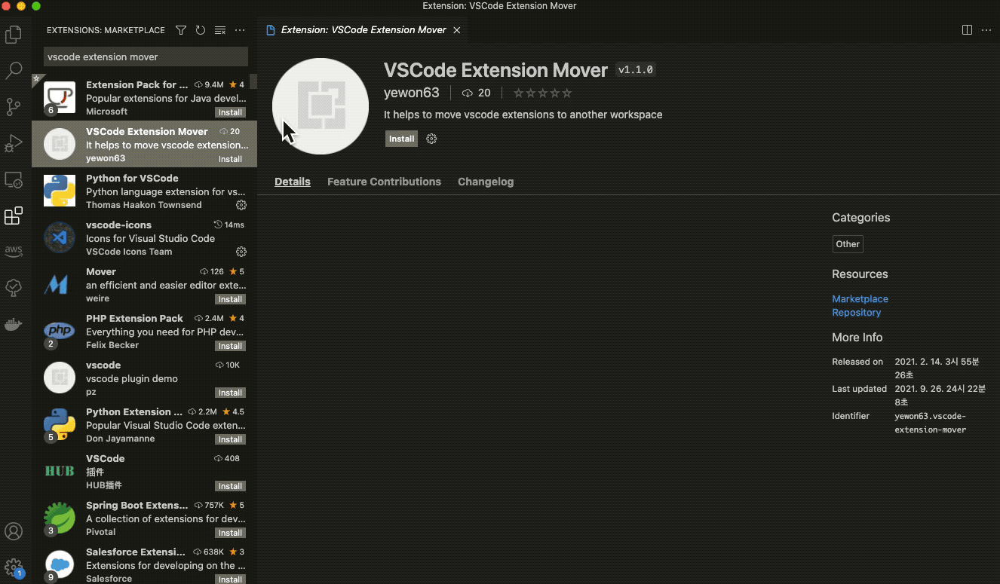

# VSCode Extension Mover

> Install vscode extensions easily using commands whenever you start to form a new development environment!

## Features

**Export all extensions (save as file or save to clipboard)**

> Get vscode installation commands and enter them on terminal!  
> and delete the vscode extension directory! (This extension only open it.)

## Settings

All you prepare is this: [Install 'code' command in PATH](https://code.visualstudio.com/docs/setup/mac#_launching-from-the-command-line)
